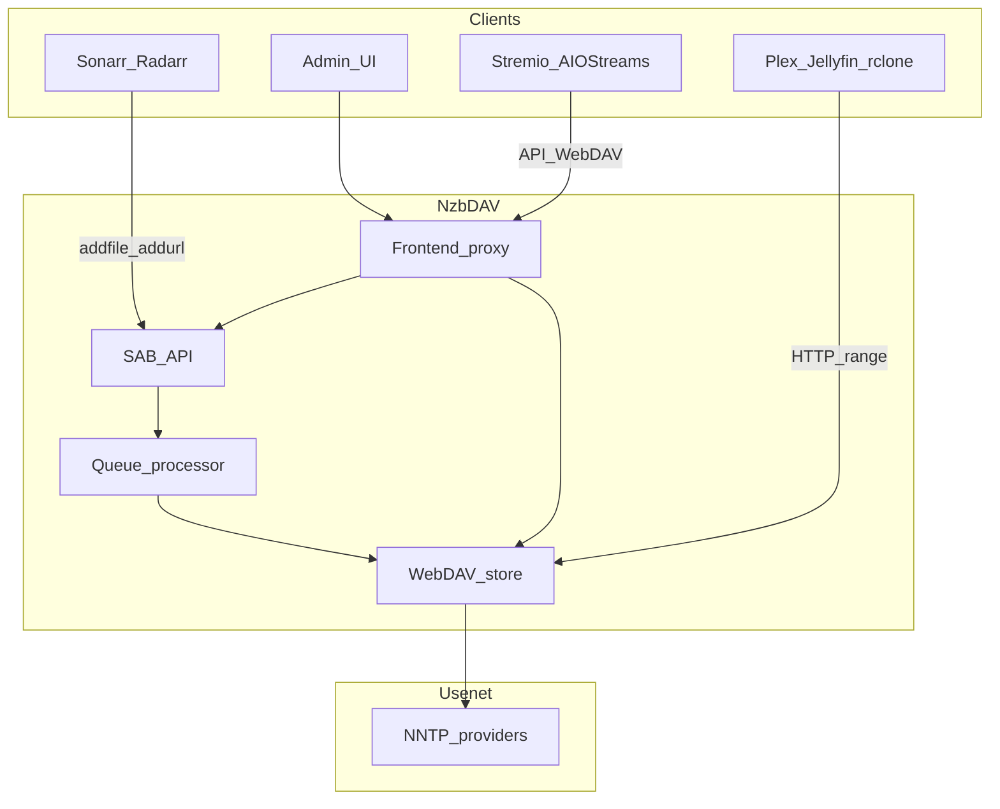

# Architecture

NzbDAV sits between download clients / search and Usenet providers, exposing a virtual filesystem and SAB-compatible API.

## Two common flows

### Automation (*Arr + media server)

1. Radarr/Sonarr sends an NZB to NzbDAV as a SABnzbd download client.
2. NzbDAV mounts the release on WebDAV without downloading the full file.
3. Import artifact:
   - **Symlinks** — entries under `completed-symlinks`; rclone turns them into filesystem links into `.ids`.
   - **STRM** — small `.strm` files with authenticated streaming URLs.
4. *Arr imports into the library; the media server reads through the link/URL → NzbDAV → Usenet.

### On-demand (Stremio)

1. AIOStreams finds a release via Newznab.
2. NZB is mounted through NzbDAV's API.
3. Playback URL (often proxied by AIOStreams) streams from WebDAV.

## Processes and ports

| Process | Default | Role |
|---------|---------|------|
| Frontend | `:3000` | Admin UI, auth, proxy for WebDAV + `/api` + `/ws` |
| Backend | `:8080` (internal) | WebDAV, queue, SAB API, SQLite under `CONFIG_PATH` |

Persistent state lives under `/config` (DB, settings, blobs, backups).

## Related

[Import strategies](import-strategies.md) · [Features overview](../features/index.md) · [Environment variables](../configuration/environment-variables.md)
