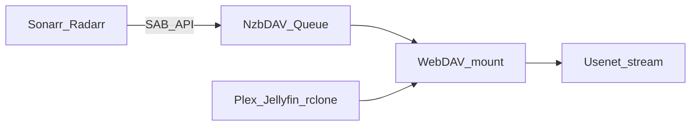

<div class="nzbdav-hero" markdown>


# NzbDAV

<p class="nzbdav-tagline" markdown>
**Mount NZBs as a virtual filesystem and stream directly from Usenet** — without downloading full media files first.
</p>

<div class="nzbdav-cta" markdown>

[Get started](getting-started/index.md){ .md-button .md-button--primary }
[View on GitHub](https://github.com/nzbdav/nzbdav){ .md-button }
[Docker image](https://github.com/nzbdav/nzbdav/pkgs/container/nzbdav){ .md-button }

</div>

<div class="nzbdav-badges" markdown>

[](https://github.com/nzbdav/nzbdav/releases)
[](https://github.com/nzbdav/nzbdav/pkgs/container/nzbdav)
[](https://github.com/nzbdav/nzbdav/actions)
[](https://github.com/nzbdav/nzbdav/blob/main/LICENSE)

</div>

</div>

NzbDAV is a **WebDAV server** that mounts NZB documents as a browsable virtual filesystem. Content streams on demand from your Usenet provider. A **SABnzbd-compatible API** lets Sonarr, Radarr, and similar tools use it as a drop-in download client — so you can build an effectively infinite media library without storing full files on disk.



## Why NzbDAV

<div class="grid cards" markdown>

-   :material-folder-network:{ .lg .middle } __Virtual filesystem__

    ---

    Browse NZB contents instantly over WebDAV. No full download before you open a file.

    [:octicons-arrow-right-24: WebDAV filesystem](features/webdav-filesystem.md)

-   :material-play-circle:{ .lg .middle } __Stream and seek__

    ---

    Jump anywhere in a video. Optional NNTP pipelining for higher throughput and faster seeks.

    [:octicons-arrow-right-24: Streaming](features/streaming-seeking.md)

-   :material-download-network:{ .lg .middle } __*Arr compatible__

    ---

    SABnzbd API surface for Sonarr and Radarr, with symlink or STRM import strategies.

    [:octicons-arrow-right-24: Infinite library](use-cases/infinite-library-arr.md)

-   :material-shield-check:{ .lg .middle } __Multi-provider__

    ---

    Cascade routing, circuit breakers, data caps, and automatic failover across providers.

    [:octicons-arrow-right-24: Multi-provider](features/multi-provider.md)

</div>

## How NzbDAV compares

Choosing between streaming WebDAV tools and classic download clients depends on your media server, disk budget, and how much ops surface you want.

<div class="grid cards" markdown>

-   :material-scale-balance:{ .lg .middle } __Honest comparison__

    ---

    NzbDAV vs AltMount vs classic SABnzbd/NZBGet — feature table and audience guidance.

    [:octicons-arrow-right-24: Compare alternatives](guides/compare.md)

</div>

## Quick start

=== "Docker run"

    ```bash
    docker run --rm -it -p 3000:3000 ghcr.io/nzbdav/nzbdav:latest
    ```

    Ephemeral trial — settings are discarded when the container exits.

=== "Docker Compose"

    ```yaml
    services:
      nzbdav:
        image: ghcr.io/nzbdav/nzbdav:latest
        container_name: nzbdav
        restart: unless-stopped
        ports:
          - "3000:3000"
        environment:
          PUID: "1000"
          PGID: "1000"
          TZ: Etc/UTC
        volumes:
          - ./config:/config
    ```

=== "DUMB stack"

    NzbDAV is a **fully supported core module** in [Debrid Unlimited Media Bridge (DUMB)](https://dumbarr.com/). Enable NzbDAV during DUMB onboarding (or set Arr `core_service` to include `nzbdav`) for guided Usenet WebDAV + download-client wiring.

    [NzbDAV on dumbarr.com](https://dumbarr.com/services/core/nzbdav/){ .md-button .md-button--primary }
    [Hosting options](getting-started/index.md#setup-and-hosting-options){ .md-button }

Then open `http://localhost:3000` (self-hosted) or your DUMB service URL, create your admin account if needed, and configure a Usenet provider under **Settings**.

!!! warning "Expose carefully"

    Port `3000` is plain HTTP. Put NzbDAV behind HTTPS for remote access. WebDAV uses Basic auth, so TLS matters. Prefer binding `127.0.0.1:3000:3000` when a reverse proxy runs on the host.

[Full Docker guide](getting-started/docker.md){ .md-button .md-button--primary }
[Migrate from another build](getting-started/migration.md){ .md-button }
[First-run checklist](getting-started/first-run.md){ .md-button }

## Documentation

<div class="grid cards" markdown>

-   :material-rocket-launch:{ .lg .middle } __Getting started__

    ---

    Install with Docker, complete first-run setup, connect Radarr and Sonarr.

    [:octicons-arrow-right-24: Start here](getting-started/index.md)

-   :material-book-open-page-variant:{ .lg .middle } __Guides__

    ---

    Architecture, import strategies, rclone mounts, media servers, Stremio, troubleshooting.

    [:octicons-arrow-right-24: Browse guides](guides/architecture.md)

-   :material-cog:{ .lg .middle } __Configuration__

    ---

    What every Settings control does, plus the headless environment-variable schema.

    [:octicons-arrow-right-24: Settings reference](configuration/index.md)

-   :material-lightbulb:{ .lg .middle } __Use cases__

    ---

    Infinite library with *Arr, streaming-only setups, multi-provider failover.

    [:octicons-arrow-right-24: Use cases](use-cases/index.md)

</div>

## Community

Chat on Discord, track releases on GitHub, and file issues when you need a durable bug report.

[Join Discord `#nzbdav`](https://discord.gg/EJaptcg9UY){ .md-button .md-button--primary }
[Repository](https://github.com/nzbdav/nzbdav){ .md-button }
[Releases](https://github.com/nzbdav/nzbdav/releases){ .md-button }
[Issues](https://github.com/nzbdav/nzbdav/issues){ .md-button }
[Community hub](community/github.md){ .md-button }

## Ecosystem

NzbDAV owns the streaming stack end to end. Complementary managed libraries — **UsenetSharp**, **RapidYencSharp**, **rapidyenc**, and **SharpCompress** — land connection, decode, and archive fixes in the right layer so playback improvements ship with the product.

[About the project](community/about.md){ .md-button }

## License

NzbDAV is released under the [MIT License](https://github.com/nzbdav/nzbdav/blob/main/LICENSE).

!!! warning "Disclaimer"

    NzbDAV is intended for use with **legally obtained or public domain** content only. The maintainers do not condone piracy and will not provide support for copyright infringement.
