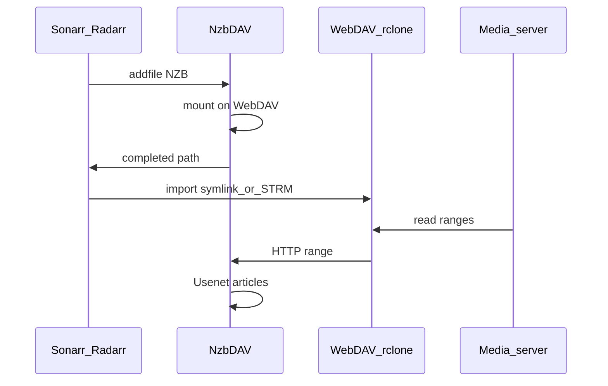

# Infinite library with *Arr

Opinionated production path for maximum “always available” library feel with minimal local storage.

## Checklist

1. [Docker deploy](../getting-started/docker.md) with `/config` and shared `/mnt` (or equivalent).
2. [First run](../getting-started/first-run.md) — providers, WebDAV, API key.
3. Pick [import strategy](../guides/import-strategies.md):
   - Plex → symlinks + [rclone mount](../guides/mounting-webdav.md)
   - Emby/Jellyfin → STRM + Base URL
4. [Connect Radarr/Sonarr](../getting-started/connect-arr.md) as SAB client + register instances in NzbDAV.
5. Enable [Repairs](../configuration/repairs.md) with **Library Directory**.
6. Optional: [Watchtower](../features/watchtower.md), indexer [profiles](../configuration/profiles.md), [backups](../guides/backups-upgrades.md).

## Operations

- Retention and orphan cleanup — [Operations](../operations/retention-cleanup.md)
- Deletion surprises — [Deletion audit](../operations/deletion-audit.md)
- Speed tuning — Max Download Connections on [WebDAV](../configuration/webdav.md)
